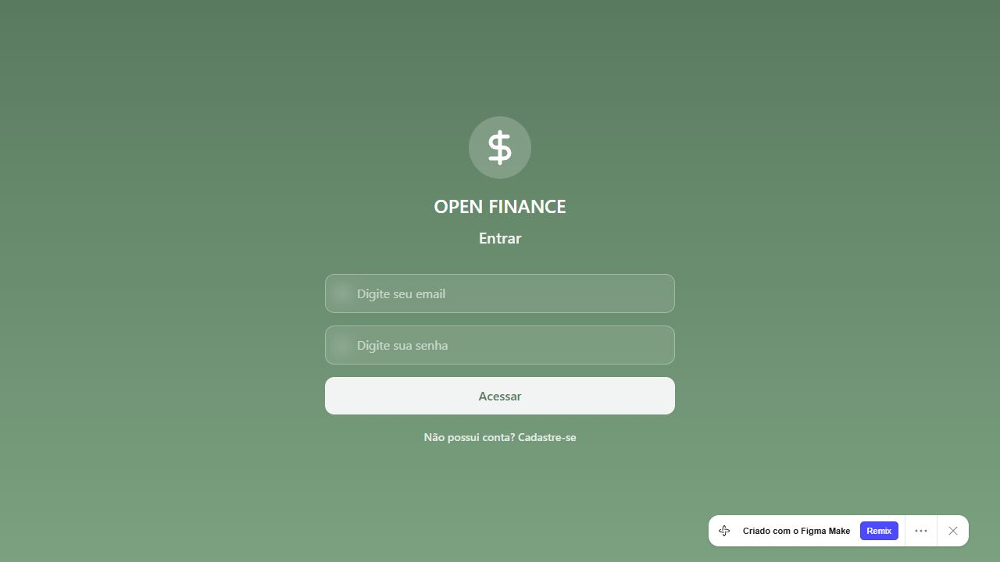

# Controle financeiro — estudo de interface

Protótipo de interface para organização de receitas, despesas e saldo pessoal, publicado no Figma Community.

**[Abrir no Figma](https://www.figma.com/community/file/1637986220810727551)** · [Abrir a demonstração](https://openfinance.figma.site/)

## Prévia

Captura real da tela inicial. A página do Figma identifica a publicação como um projeto de Figma Make.

## Objetivo

Explorar a apresentação de informações financeiras e a prototipação de interfaces. O repositório reúne contexto e links de visualização; não contém o código-fonte da demonstração.

## Como visualizar

1. Abra a página do Figma Community pelo link acima.
2. Veja a prévia incorporada ou selecione **Visualizar** para abrir a demonstração.
3. A demonstração começa pela tela de acesso. A captura neste README permite conhecer essa tela sem cadastro.

## Escopo e limitações

- Este é um estudo de interface, não uma apresentação de serviço financeiro em produção.
- Os fluxos posteriores ao login, persistência de dados e integrações não foram verificados nesta documentação.
- Não é necessário instalar dependências para consultar este repositório.
- O [backend do Site Financeiro](https://github.com/gabrieldalmeida0/arb-finance-backend) é documentado separadamente; este README não afirma que a demonstração do Figma esteja integrada a ele.

## Contato

[Gabriel D'Almeida](https://github.com/gabrieldalmeida0) · [Portfólio](https://gabrieldalmeida0.github.io/portfolio/)
